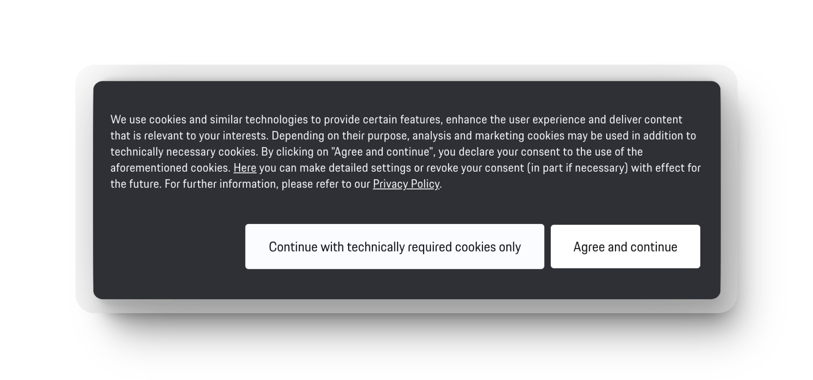
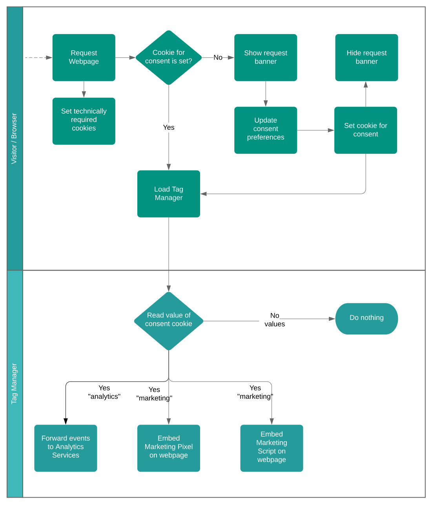

  

# Cookie Consent Banner

👉 _See the component in action on the websites of the following projects: [**Cyklær**](https://www.cyklaer.de), [**Simutrack**](https://www.simutrack.de/) and [**VIN-Art**](https://www.vinart.digital/?s=ccb)._ 👈

  
Sometimes it's not possible to avoid cookies for which we need consent of the visitors of our web applications.
For that, some kind of component might help which provides a sleek, but customizable UI with an easy to use API.

That's where the Cookie Consent Banner comes in.

In order to focus on the things that really matter, the Cookie Consent Banner supports us to fulfill that requirement.
It visualizes the available categories, like `technically required` and `analysis`, stores the decision of the user and provides an event-based API for you to handle appropriately. And of course, the consent data is stored locally in the vistor's browser.

- [Consent Flow](#arrows_counterclockwise-consent-flow)
- [Documentation](#spiral_notepad-documentation)
  - [Web Component – Vanilla JS](#web-component--vanilla-js)
  - [React Component](#react-component)
- [Disclaimer](#disclaimer)
- [Contributing](#contributing)
- [License](#license)

## :arrows_counterclockwise: Consent Flow

The consent banner has two tasks: Providing a UI Component to allow visitors of your web application to choose which cookies they want to accept, and the ability to react on the choosen settings via an API.

There are two typical scenarios: Either the external scripts, which set cookies are managed through a tag manager of your choice using the consent data, or the scripts are loaded or configured directly on code level.

### Using a Tag Manager

The flow could look like this: Every script that sets cookies which require a consent from the visitor is blocked by default.
Instead, the Consent Banner is shown. Once the visitor updates its preferences an event is triggered (`cookie_consent_preferences_updated`).
Additionally the consent data is stored within a cookie in a format that can be parsed either programmatically or with a tag manager (e.g.: name: `cookies_accepted_categories`, value: `technically_required,analytics,marketing`). A tag manager could read the value of that `1st-Party Cookie` before any other script (tag) is loaded (e.g.: Fire trigger only `if Accepted Cookie Categories contains marketing`).

### Using the API directly

Have a look on the Real World example using the React Component: [`packages/cookie-consent-banner-react`](packages/cookie-consent-banner-react#-real-world-example-with-tag-manager-and-custom-error-tracking).

## :spiral_notepad: Documentation

The Cookie Consent Banner supports multiple frontend frameworks, because it is built as an agnostic web component.
For easier integration we also provide a wrapper component for React environments.
It's necessary to set at least the required properties for the component in order to work properly (see the provided examples).

### Web Component – Vanilla JS

Follow the documentation of the Web Component: [/packages/cookie-consent-banner](/packages/cookie-consent-banner)

### React Component

Follow the documentation of the React Component: [/packages/cookie-consent-banner-react](/packages/cookie-consent-banner-react)

---

## Disclaimer

_Please note that you must individually assess the legal requirements regarding the implementation of the Cookie Consent Banner, in particular which choices to offer in which granularity and which information to provide in which detail and at which point of the user journey. The examples mentioned are not intended to provide any advice regarding legal requirements. All responsibility for the implementation of the Cookie Consent Banner and its compliance with legal requirements lies with the user._

## Contributing

See [CONTRIBUTING](./CONTRIBUTING.md).

## License

See [LICENSE](./LICENSE.md).
